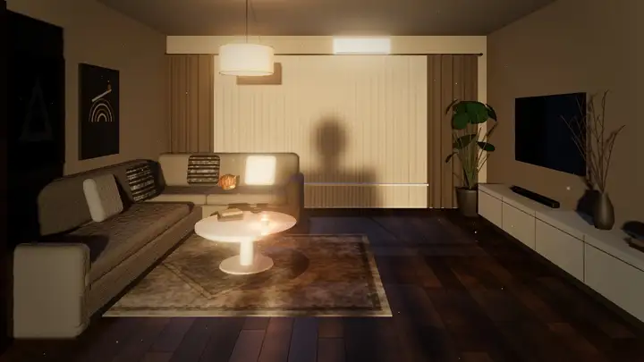
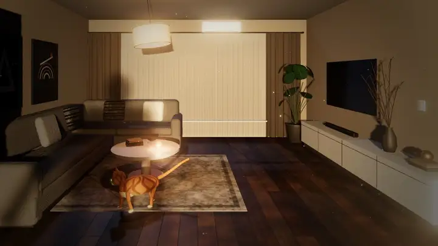
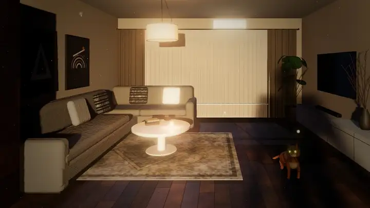
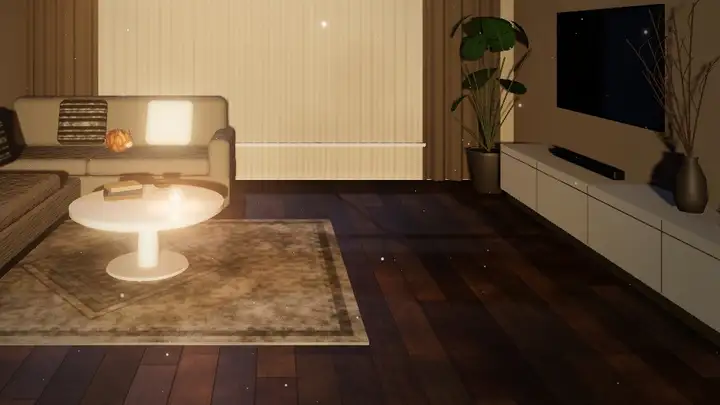
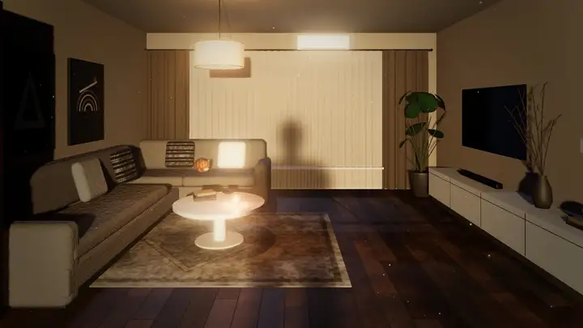
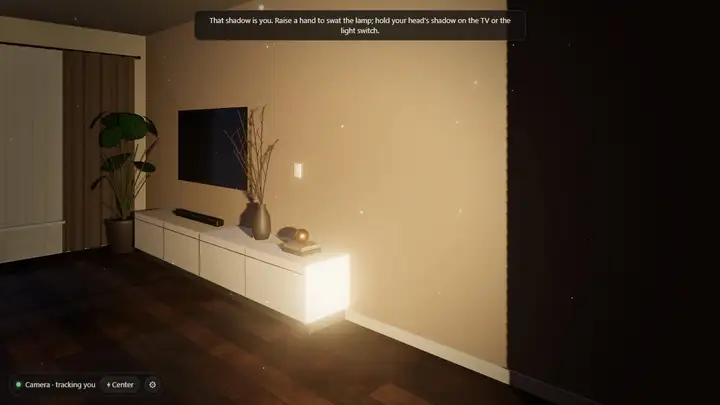
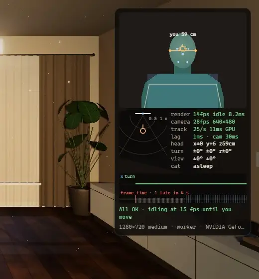

<p align="center">◐ &nbsp; S H A D O W &nbsp; R O O M</p>

<h1 align="center">Your shadow, in another room.</h1>

<p align="center">A live 3D wallpaper of a dark living room. Your webcam silhouette casts a real shadow into it, the view moves with your head, and a cat chases the shadow of your hand.</p>

<p align="center"><a href="https://rathatart.github.io/shadow-room/">Try it in your browser</a> · <a href="https://github.com/RathaTart/shadow-room/releases/latest/download/ShadowRoom-Lively.zip">Download for Lively</a> · <a href="#run-it">Run locally</a> · <a href="https://rathatart.github.io/shadow-room/docs/media/tour.webm">Watch the tour</a> · <a href="THIRD_PARTY.md">Credits</a></p>


## What it does

| Feature | You… | The room… |
| --- | --- | --- |
| [**Your shadow**](#your-shadow-for-real) | sit in front of the webcam | gets your silhouette as a real, soft-edged shadow, cast by a light behind you |
| [**Shadow touch**](#touch-things-with-your-shadow) | let your shadow touch things | reacts: the lamp swings, pillows hop, paintings tilt, curtains ripple |
| [**Lights & TV**](#lights-and-tv) | hold your head's shadow on the TV or the light switch | turns the TV on, or the ceiling lamp off |
| [**The cat**](#the-cat) | raise a hand | wakes a cat that chases your hand's shadow like a laser dot |
| [**Look around**](#look-all-around) | turn your head a little | turns a lot: 10° looks to the side, 15° looks behind you |
| [**Window effect**](#a-window-not-a-picture) | move your head | shifts its perspective like a real window |
| [**Center**](#center-your-normal-head-position) | press **⌖ Center** | takes your normal sitting pose as straight ahead |
| [**Tracking view**](#tracking-view) | press **V** | shows what the webcam and the tracker see, stage by stage |

Everything runs on your computer. three.js, MediaPipe and the pose model are bundled, so webcam frames never leave the page. No webcam, or you'd rather not? A demo figure plays your part, and the mouse can steer it ([open the demo](https://rathatart.github.io/shadow-room/?demo=1)).

> The clips below were recorded from the app itself in headless Chrome. They use the built-in demo figure, or a simulated person fed through the tracker. None of them is webcam footage. See [What the clips show](#what-the-clips-show).

## Features

### Your shadow, for real



A light stands in the hallway behind you, and your silhouette stands in the doorway at human scale, so the shadow behaves like a real one:

- It falls across the curtains, bends over the sofa and softens at its edges.
- Lean toward the screen and it shrinks and sharpens; lean back and it grows.
- Raise a hand to swat the ceiling lamp. While the lamp swings, every shadow in the room swings with it.

<sub>Demo figure, real-time speed.</sub>

### Touch things with your shadow



Each object tests a few points against your shadow, and reacts when your shadow covers them:

| Touch it with your shadow | What happens |
| --- | --- |
| Ceiling lamp (raise a hand) | Swings, and every shadow in the room swings with it |
| Light switch (right wall) | Hold your shadow on it: the ceiling lamp turns on or off |
| TV | Hold your head's shadow on it (~0.6 s): it turns on or off and lights the room |
| Curtains | Ripple where your shadow's edge sweeps across them |
| Pillows | Hop and wobble |
| Paintings | Get knocked crooked (touch again to straighten them) |
| Plant leaves | Rustle |
| Candle | The flame gutters and flickers |

You can also **click** objects; Lively forwards desktop clicks to the wallpaper.

<sub>Demo figure, 2× speed.</sub>

### Lights and TV



Hold your head's shadow on the TV for about half a second and it switches on, filling the room with its changing light. Do the same on the light switch beside it, and the ceiling lamp goes out. **T** and **L** do the same from the keyboard.

<sub>Demo figure, 2× speed.</sub>

### The cat



A ginger tabby lives in the room. Hold a hand out and the shadow of your hand becomes its laser dot. It finds its way around the furniture on a 10 cm floor grid (A*), and its eyes catch the light in the dark.

| It… | When |
| --- | --- |
| Sleeps on the sofa, curled up | Nothing has happened for a while |
| Wakes, jumps down and chases the shadow of your hand | You raise a hand, or hold an arm out |
| Crouches, wiggles and pounces, then sits on the dot and bats at it | It catches up with a dot on the floor |
| Waits under the dot, reaching up and batting the curtain | The dot is on the wall |
| Bolts to a hideout, ears back, and hides for a few seconds | Your shadow looms over it |
| Paws at the curtain, watches the TV, or wanders | It is awake and bored |
| Tilts its head when you tilt yours | It is sitting and looking at you |
| Stretches and wakes, or looks at you | You click it |

The *cat* row of the tracking view says what it is doing. Turn it off with the *Cat* setting.

<sub>Demo figure holding its arm out: the dot is the shadow of its hand. Real-time speed, cropped.</sub>

### Look all around


Turning your head turns the view the same way, and nodding looks up or down. The turn, nod and tilt come from where your face (nose, eyes, mouth) sits against the line between your ears.

You still have to watch the monitor, so a small turn does a lot:

- At the default sensitivity, **10° of head turn looks 90° to the side** and **15° looks straight behind you**. A hallway runs back to the front door there, with the lamp that casts your shadow standing in it.
- About **10° of nod** looks at the ceiling or the floor.
- Small movements are ignored, and a held turn stays steady.
- Turning back always brings the view back, so a glance at another monitor doesn't leave the room rotated.

Turn off *Look all around* for a gentle ±40° left/right-only version, or set *Head turn sensitivity* to 0.

<sub>Simulated head poses: turns of 10°, 16.5°, back to 0°, −8°, then an 8° nod up. Real-time speed.</sub>

### A window, not a picture



The camera uses an off-axis projection that follows your eyes. Move sideways and you look around the sofa; lean in and the room opens up at the edges, like a real window. Your distance comes from how far apart your eyes appear (about 63 mm in reality), cross-checked with your shoulder width. No depth camera is needed.

<sub>Simulated head moving 13 cm left and right, then leaning in from 60 to 45 cm. Head turn is off for this clip.</sub>

### Center: your normal head position



Straight ahead is your normal sitting pose, not whatever pose you had when the webcam opened.

1. Press **⌖ Center**. It's bottom left and appears when you move the mouse. The **C** key and *Center* in Lively's settings do the same.
2. Sit as you normally do, and look at the target in the middle of the screen during the 3-second countdown.

The pose is saved and used from then on.

<sub>Real-time recording of a simulated person whose normal pose is turned 7°, so the room faces the side wall until centering.</sub>

### Tracking view

<p align="center"></p>

Press **V** for a live diagnostic panel. It shows:

- the frame the pose model analysed, with your mask, skeleton and ear line
- a top-down map of where the tracker thinks you are
- one row per stage, which turns amber or red when that stage is the problem

It's on by default in the browser. In Lively it starts off, so your webcam picture stays off the desktop while you share your screen. Nothing is recorded.

<details><summary><strong>What each row means</strong></summary>

| Row | Shows |
| --- | --- |
| render | Frames per second, and main-thread milliseconds per frame. *idle* means nothing is moving, so fewer frames are drawn on purpose |
| camera | Frames per second the webcam actually delivers |
| track | Detections per second, milliseconds per detection, GPU or CPU. With nobody in view it checks only 6 times per second |
| lag | Time from frame grabbed to result, plus how old the frame already was (`cam`) |
| head | Where it puts you: cm right/up of the webcam, and distance |
| turn | Your head's turn, nod and tilt (`r`) from your rest pose |
| view | Where that points the room: left/right, up/down |
| cat | What the cat is doing |

- **Graph, last 4 s.** On top, dots are raw measurements and lines are what the view followed, for sideways position (blue) and head turn (green). The gap between them is smoothing lag. Below it is the time between frames: red bars came late, blue bars are idle frames.
- **Hint line.** The most likely culprit.
- **Footer.** The drawing size, whether tracking runs in the worker, and which GPU the page got. On laptops, check that it is the dedicated GPU.

</details>

<sub>Real-time recording. The person, the mask and the track numbers are simulated. The render and camera rows are the page's own live measurements, with Chrome's test camera.</sub>

## Run it

### In your browser

Open **[rathatart.github.io/shadow-room](https://rathatart.github.io/shadow-room/)** and allow the camera. It's tested in Chrome and Edge on Windows. Check that the browser's graphics acceleration is on (in Chrome: *Settings → System*).

### Locally

It needs [Node.js](https://nodejs.org), for a tiny local server. There's nothing to `npm install`.

```sh
git clone https://github.com/RathaTart/shadow-room.git
cd shadow-room
node tools/serve.mjs --open
```

On Windows you can double-click `start.bat` instead. The server listens on **http://localhost:8765/** and answers only this machine. Opening `index.html` directly doesn't work, because browsers block ES modules on `file://`.

### As your desktop wallpaper (Windows, Lively Wallpaper 2.2+)

1. Download **[ShadowRoom-Lively.zip](https://github.com/RathaTart/shadow-room/releases/latest/download/ShadowRoom-Lively.zip)**. To build it yourself instead, run `node tools/package-lively.mjs`, which writes `dist/ShadowRoom-Lively.zip`.
2. Drag the zip onto [Lively](https://github.com/rocksdanister/lively), or click **+** and pick it.
3. Customize it in Lively's wallpaper settings. Every option below is there.

> **Camera permission in Lively.** Lively's web player asks for the camera through WebView2. To make the permission stick between restarts, turn on **Lively → Settings → Wallpaper → Web browser → Disk cache**. If no prompt ever appears, use the browser version, or turn on *Demo figure* in the wallpaper settings.

## Settings and keys

Open the panel with **S**, or the ⚙ button that appears when you move the mouse.

| Setting | What it does |
| --- | --- |
| Use webcam / Demo figure | Your webcam silhouette, or the choreographed demo figure |
| Shadow light, height, distance | The light behind you: its brightness and where it stands |
| Softness / Shadow travel | Penumbra blur / how far the shadow moves when you move sideways |
| Head-tracked parallax / Auto-center | Strength of the window effect / slowly re-centre on where you usually sit |
| Head turn sensitivity | How far the room turns for a head turn. At 1.5, 10° looks 90° to the side and 15° straight behind. 0 turns it off |
| Look all around (360°, up/down) | Behind you, and up and down. Off: ±40° left/right only |
| Cat | The cat that lives in the room |
| Webcam FOV, Mirror | Better distance and position estimates for your camera |
| Ceiling lamp, brightness, Moonlight, Exposure | Room mood |
| Quality, FPS cap, Bloom, Dust, Film grain | Performance and look |
| Show tracking view | The diagnostic panel above |

**Keys:** `S` settings · `H` hide UI · `C` center my head · `D` demo on/off · `L` lamp · `T` TV · `P` silhouette preview · `V` tracking view

Settings are saved in the browser; in Lively, Lively's panel controls them. Any setting can also be set in the URL for one visit, without saving it: for example `?demo=1` or `?quality=low&headTurn=2`.

## How it works

```text
Webcam ─► MediaPipe Pose (worker thread, on this PC) ─► body mask + eyes + ears + distance
   │                                          │
   │               ┌──────────────────────────┴───────────────────────────┐
   ▼               ▼                                                      ▼
head position   silhouette drawn on a "body plane" in the doorway      presence
+ head turn        │  (low body synthesised if the webcam cuts it off)  (shadow fades
   │               ▼                                                     when you leave)
   ▼            rendered from the hall light's view into a texture
off-axis        used as that light's cookie (SpotLight.map)
camera             │
(window effect,    ├─► soft shadow on every surface the light reaches (three.js)
turns with you)    ├─► dust motes in the beam go dark inside your silhouette
                   ├─► objects test sample points against your shadow → react
                   └─► your raised hand's shadow → the cat's laser dot
```

- **Physically placed shadow.** The hall light stands 2.6 m behind the doorway, and your silhouette sits in the doorway at real human scale. Leaning toward the screen shrinks and sharpens the shadow, as a real one would. That's the opposite of what the camera sees.
- **Distance without a depth camera.** The pixel distance between your eyes (~63 mm apart) gives your distance, cross-checked with your shoulder width. A turned head's foreshortening is corrected first.
- **Head-coupled perspective.** Moving your head skews the projection, so the screen acts like a window.
- **Head turn → view turn.** A dead zone ignores small movements. A curve then maps about 15° of turn to 180°. One Euro filters and a gentle second smoothing keep a held turn steady.
- **The cat.** A procedural rig blends a few poses (stand, sit, crouch, loaf, stretch, leap). It plans paths with A* on a 10 cm floor grid around the furniture. Its states are sleep, chase, pounce, flee, hide and a few idle ones. The laser dot is where the hall light's ray through your raised hand first meets the floor or a wall.
- **Low lag.** Pose detection runs in a Web Worker, so it never holds up a frame. Each new webcam frame is analysed once. Each measurement reaches the filters once, stamped with when it was captured.
- **Windows GPU workaround.** On Chrome, Edge and WebView2 for Windows, MediaPipe's GPU segmentation mask is an RGBA8 texture, and its built-in float readback returns zeros. The tracker reads the texture itself. If masks still come back empty, it switches to the CPU delegate.

## Privacy

Everything runs locally. three.js, MediaPipe (WebAssembly) and the pose model are bundled in `vendor/`. The page loads only its own files and **never contacts another server**, and webcam frames never leave your computer. Nothing is recorded or stored except your settings.

The camera is released whenever the page is hidden, or when Lively pauses the wallpaper (for example, while a fullscreen app is open).

## Performance

A wallpaper runs all day, so Shadow Room does as little work as it can:

- **Fewer frames while nothing moves.** When your head, your body and the room are all still, it renders 15 frames per second instead of the cap. The dust, grain, candle and curtains keep drifting. The moment the tracker sees you move, or something in the room animates, it goes back to the full rate.
- **Shadow maps are reused.** Redrawing them means rendering the room three more times. So that happens only when something that casts shadows moves, plus twice a second. Your own shadow is redrawn every frame.
- **One final pass** adds the bloom, tone-maps and applies the film look.
- **Nobody in view?** The webcam is checked 6 times per second instead of 24, and goes back to full rate as soon as it finds you.

The table shows the power the page adds on top of the idle desktop (~11 W). It was measured at 1920×1080, *medium* quality and a 30 fps cap, on one RTX 3060 Laptop GPU:

| Situation | First version | Now |
| --- | --- | --- |
| Webcam, you sitting still | ~11 W | ~4 W |
| Webcam, nobody in view | ~11 W | ~2.5 W |
| Demo figure (always moving) | ~8 W | ~4 W |

> **Task Manager's "GPU %" may look about the same.** With less work, the GPU lowers its clock speed, and the remaining work fills a similar share of each second. The saving shows up as power and clock speed: less heat, a quieter fan and longer battery life.

- Detection runs at most 15 / 24 / 30 times per second on *Low* / *Medium* / *High*.
- On weaker machines, use *Quality: Low*. It lowers the resolution and the shadow-map size, and turns off bloom and film grain.
- In Lively, let it pause the wallpaper while other apps cover the desktop (Lively → Settings → Performance).
- To compare against the old behaviour, use `?idle=0` (always render at the cap) and `?worker=0` (run tracking on the main thread).

## Troubleshooting

<details><summary><strong>It feels laggy</strong></summary>

Open the tracking view (**V**) and look for the amber or red row.

- *camera* under ~20 fps usually means too little light: webcams slow down to expose longer.
- *render* marked *idle* is normal: nothing is moving, so it saves frames.
- *render* amber or red means the GPU is struggling. Lower *Quality* or the *FPS cap*. On a laptop, check that the footer names the dedicated GPU. If it doesn't, set Lively or the browser to *High performance* in Windows Settings → System → Display → Graphics.
- If the hint says **NO GPU**, the browser is drawing in software. In Chrome, turn on *Settings → System → Use graphics acceleration when available*, then restart it.
- *track* on CPU, or the footer saying *main thread*, means the fast tracking path is unavailable. The hint line says why.

</details>

<details><summary><strong>The room is turned while I look straight at the screen</strong></summary>

Press **⌖ Center** (or **C**), then sit normally and look at the target during the countdown.

</details>

<details><summary><strong>The view turns when I don't want it to</strong></summary>

This happens when you look at the keyboard or another monitor. Lower *Head turn sensitivity*, turn off *Look all around*, or set the sensitivity to 0.

</details>

<details><summary><strong>"Demo mode: the camera is busy in another app"</strong></summary>

Close the other app, or turn on *Windows Settings → Bluetooth & devices → Cameras → your camera → Advanced camera settings → Allow multiple apps to use camera at the same time*.

</details>

<details><summary><strong>No shadow in a dark room</strong></summary>

The tracker needs to see you. A little light on your face is enough, such as the monitor's own glow or a small desk lamp.

</details>

<details><summary><strong>The shadow is in the wrong place or the wrong size</strong></summary>

Press **⌖ Center** (or **C**), and set *Webcam FOV* to your camera's real value. Most laptop webcams are 60–78°.

</details>

## What the clips show

- **Where they come from.** They were recorded from the running app at 1280×720, in headless Chrome, and converted to animated WebP. The renderer, lighting, cat and interactions are the app's own.
- **Demo figure clips** use the silhouette that stands in when there is no webcam. It follows its own choreography, or a scripted pose in the cat clip.
- **Simulated person clips** feed synthetic pose landmarks and a body mask into the tracker's normal input path in place of MediaPipe's output. That makes the head movements exact and repeatable. With a webcam, MediaPipe produces those inputs from your image.
- **Speed.** Most clips were stepped frame by frame, so they play smoothly at the stated speed. The Center and Tracking clips were recorded in real time.
- **Power figures** in [Performance](#performance) come from one laptop; yours will differ.

## Project map

```text
index.html              page shell (import map, Lively callback queue)
src/main.js             renderer, loop, webcam/demo input, centering, Lively bridge
src/room.js             the room: walls, sofa, table, TV, curtains, plant, lamp… and the hallway behind you
src/lighting.js         hall light (casts your shadow) and its lamp, moonlight, bounce light
src/silhouette.js       body-plane canvas → light cookie; "is this point in my shadow?"
src/tracker.js          webcam, frame scheduling, distance, head position and head turn
src/poseEngine.js       MediaPipe Pose + mask readback (in the worker, or the main thread as a fallback)
src/poseWorker.js       the tracking worker
src/trackingView.js     tracking view (V): what the webcam and the tracker see, and timings
src/cat.js              the cat: body, animation, path finding, behaviour
src/interactions.js     what reacts to your shadow, and how it animates
src/parallax.js         off-axis "window" camera, turned by your head
src/demo.js             demo figure choreography
src/dust.js, post.js    dust motes in the beam; bloom, tone mapping, vignette and grain in one pass
src/textures.js         procedural textures (wood, rug, fabric, paintings, city, TV)
src/curtain.js          cloth panel with ripples
src/gpu.js              which GPU WebGL got, and whether it is a real one
src/ui.js, style.css    overlay UI
tools/serve.mjs         local static server (localhost only)
tools/package-lively.mjs  builds the Lively zip
vendor/                 three.js r160, MediaPipe Tasks Vision 0.10.21, pose model
docs/media/             the clips in this README
```

## Credits & reuse

Created by **[Tart / RathaTart](https://github.com/RathaTart)**, built on [three.js](https://threejs.org) and the [MediaPipe Pose Landmarker](https://developers.google.com/edge/mediapipe/solutions/vision/pose_landmarker). Smoothing uses the One Euro filter (Casiez, Roussel & Vogel, CHI 2012). The room, its textures, the cat and the demo figure are all generated in code.

Original code is MIT-licensed ([LICENSE](LICENSE)). **This does not relicense the bundled third-party files:** three.js keeps its MIT license, and MediaPipe and the pose model keep Apache-2.0. See [THIRD_PARTY.md](THIRD_PARTY.md).

Ideas and fixes are welcome. For a performance or tracking issue, include a screenshot of the tracking view (**V**): it shows which stage is slow.
